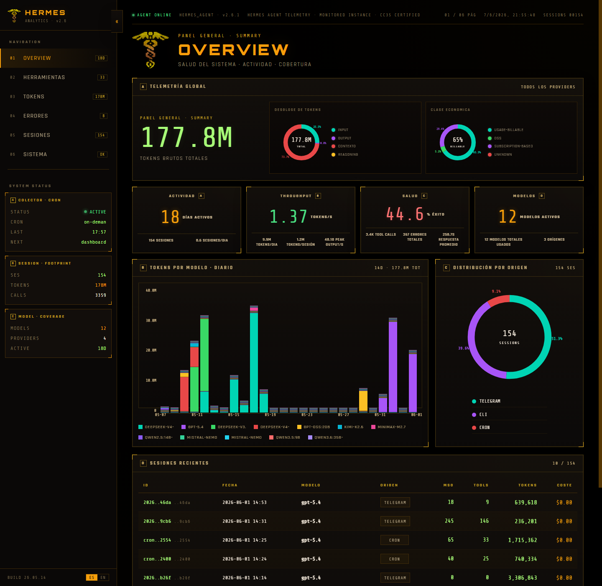
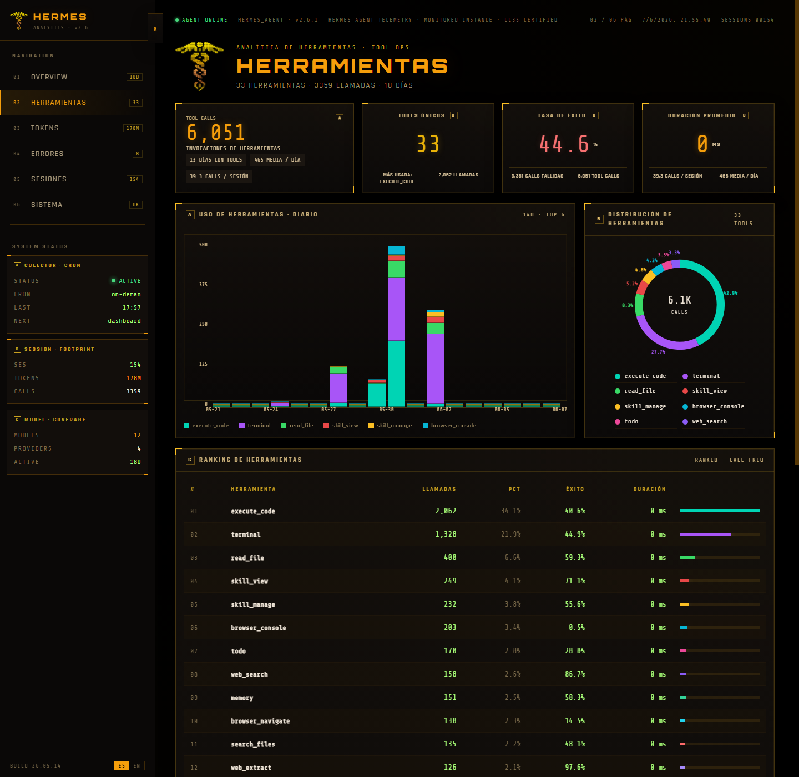
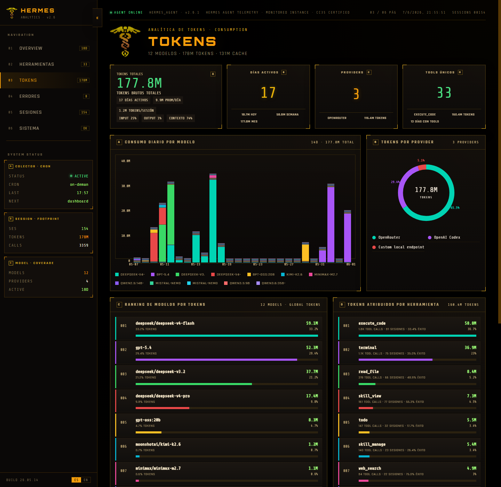
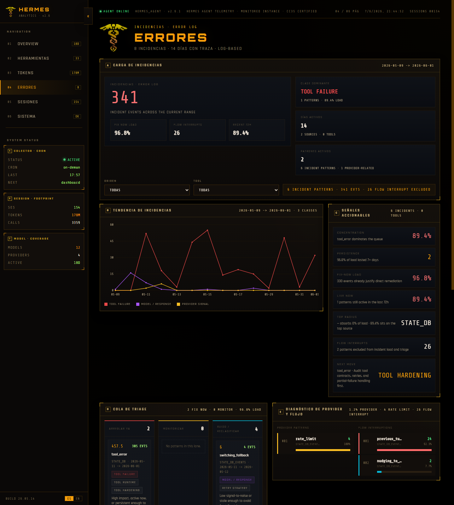
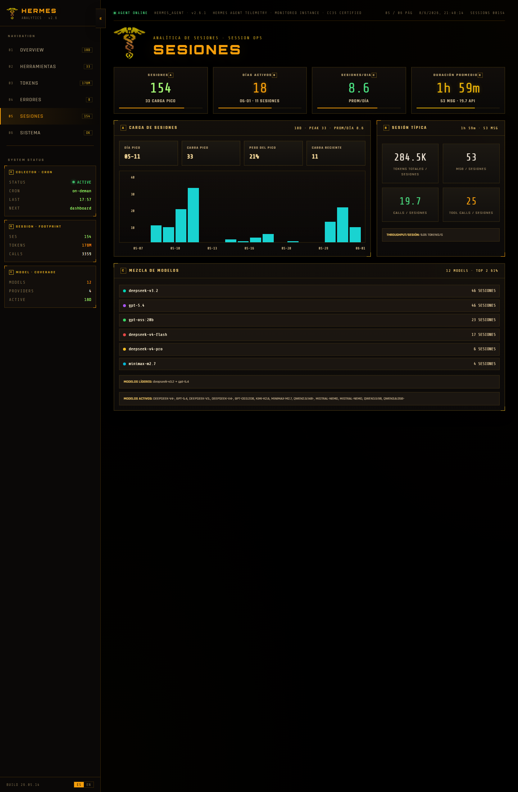
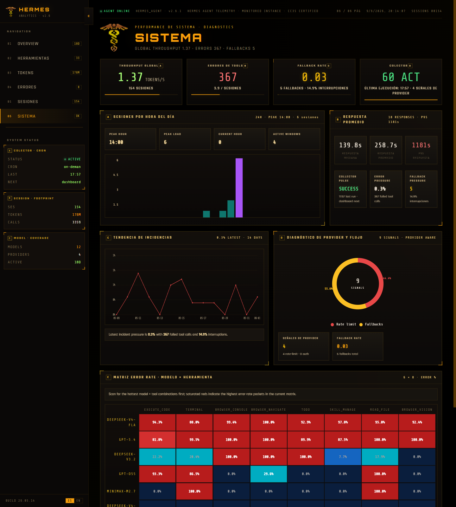
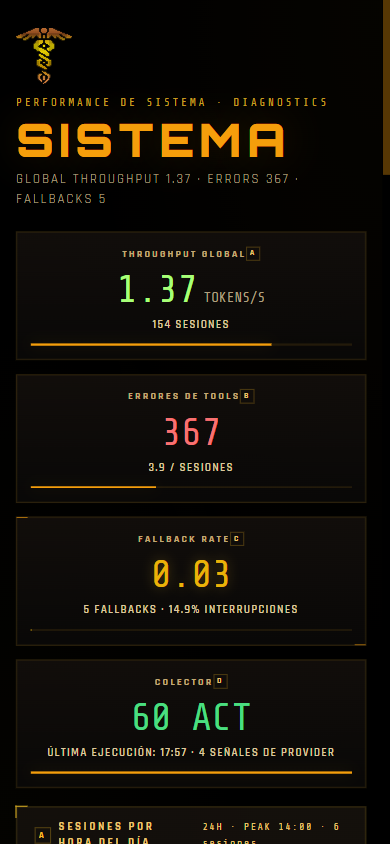

# Hermes Dashboard

Hermes Dashboard is a local analytics cockpit for Hermes activity. It turns collector output into a fast, dark HUD-style dashboard for sessions, tool calls, token consumption, incident patterns, and system health.

It is built for one job: understand how your Hermes usage is behaving without digging through raw logs.

## What It Shows

- Overview: a single-scan summary of activity, throughput, reliability, and coverage.
- Tools: which tools are used most, how often, and with what success profile.
- Tokens: daily token flow by model, provider, and attributed tool usage.
- Errors: incident clustering, daily error-rate trend, and actionable triage signals.
- Sessions: session load, typical session shape, and model mix.
- System: hourly operational pulse, response-time diagnostics, provider friction, and model × tool heatmaps.

## Gallery

### Overview



### Tools



### Tokens



### Errors



### Sessions



### System



### Mobile

| Sessions | System |
| --- | --- |
|  |  |

## Stack

- Backend: Python + Flask
- Storage: SQLite
- Frontend: React 18 UMD + runtime JSX/Babel
- Data processing: collector-driven ETL

## Project Structure

```text
api/
  flask_app.py        # API + SPA host
  static/
    app.jsx           # Shell, routing, normalization
    sections.jsx      # Tab implementations
    components.jsx    # Shared chart and panel primitives
    styles.css        # Shared visual system
collector.py          # Data collection + aggregation
dashboard.db          # Local analytics store
docs/
  DASHBOARD_DESIGN_DECISIONS.md
CONTEXT.md            # Fast-start repository memory
```

## Run It

Install dependencies:

```bash
pip install -r requirements.txt
```

Run the collector:

```bash
python collector.py
```

Start the dashboard:

```bash
python api/flask_app.py
```

Open:

```text
http://localhost:8590
```

## Access Modes

The dashboard is local-first by default.

### Localhost

This is the default and recommended mode for normal use on the same PC that runs Hermes.

- Bind host: `127.0.0.1`
- URL: `http://localhost:8590`
- Launchers: `launch-dashboard.ps1`, `launch-dashboard.bat`, `hermes-dashboard.bat`

### LAN

If you want to open the dashboard from another device on the same network, use `launch-dashboard-network.ps1`.

- Bind host: `0.0.0.0`
- Example URL: `http://192.168.1.23:8590`
- Requirement: the other device must be able to reach the PC running Hermes

### Mesh VPN

This mode also works across a private routed VPN such as Tailscale, ZeroTier, WireGuard, or OpenVPN.

- Bind host: `0.0.0.0`
- Example URL: `http://100.x.y.z:8590`
- Requirement: both devices must be on the same private VPN network

No frontend change is needed for LAN or VPN access because the app already uses same-origin requests to `/api/all`.

Do not expose this dashboard directly to the public internet. The current stack has no built-in auth and no HTTPS termination.

## Useful Commands

```bash
python collector.py --sessions-only
python collector.py --credits-only
python collector.py --full-refresh
python scripts/openrouter-credits.py --help
```

Health check:

```bash
curl http://localhost:8590/api/all
```

On Windows PowerShell:

```powershell
Invoke-WebRequest -UseBasicParsing http://localhost:8590/api/all
```

## Data Notes

- `/api/all` is the primary dashboard payload and should stay healthy.
- Tool token usage is attributed proportionally at session level; it is not direct per-call metering.
- OpenRouter billing visibility is secondary to Hermes operational telemetry.

## OpenRouter Management Key

The dashboard intentionally does not show credential setup prompts in the UI. If you want richer OpenRouter usage comparison during collection, add a Management Key to your Hermes environment file:

```env
OPENROUTER_MANAGEMENT_KEY=sk-or-v1-...
```

Use the key management page at `https://openrouter.ai/settings/keys`, then run the collector again so the dashboard can ingest the updated OpenRouter usage fields.

## Documentation

- [CONTEXT.md](./CONTEXT.md): startup snapshot of the repository
- [docs/DASHBOARD_DESIGN_DECISIONS.md](./docs/DASHBOARD_DESIGN_DECISIONS.md): cross-session UI rules
- [docs/ACCESS_MODES_DESIGN.md](./docs/ACCESS_MODES_DESIGN.md): localhost vs LAN/VPN access strategy
